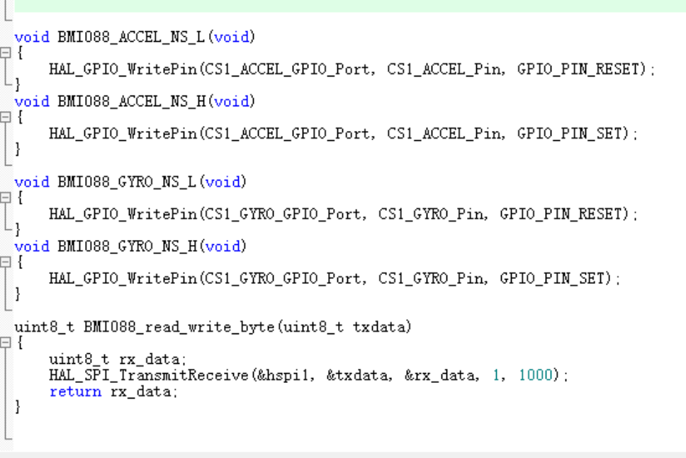

# 代码规范 {#code_guide_style}
[TOC]

## 1 命名规范

### 1.1 文件命名
全拼小写，尽量不使用下划线。
例如`can.c`/`gpio.c`。  
如果是一个库中的文件，则为了标识库，可以在开头加上库名称的缩写，例如
> // OSLIB库中  
> `oslib_can.c`  
> // SteerWheel库中  
> `sw_chassis.c`  

### 1.2 函数命名
借鉴OOP思想，使用驼峰式命名（首字母大写）+下划线，利用下划线指明所属关系。
示例：假如函数在`paw.c`中

```C
Paw_SetCloseCurrent();
Paw_GetGPIOState();
Paw_SetSwitchState_Switch1();
Paw_SetSwitchState_Switch2();
```

从函数名就可以看出这些函数属于`paw.c`，**set/get**指明函数功能，**Switch1、Switch2**指明子类型。  
+ 如果文件名过长，可以使用首字母缩写，例如`catch_throw.c`可以缩写成*ct*。

### 1.3 变量命名

+ ==全局变量名==与函数名规则相同，例如在`catch_throw.c中`：

```C
float32_t CT_Paw_CloseCurrent = 0;           // 手爪闭合电流
float32_t CT_Paw_OpenCurrent = 0;            // 手爪张开电流
float32_t CT_Paw_ForwardRotateCurrent = 0;   // 手爪正转电流
float32_t CT_Paw_ReverseRotateCurrent = 0;   // 手爪倒转电流
float32_t CT_Belt_UpCurrent = 0;             // 传送带往上转电流
float32_t CT_Belt_DownCurrent = 0;           // 传送带往下转电流
float32_t CT_FrictionWhell_ServeCurrent = 0; // 摩擦轮发球电流
```

+ ==局部变量名==由于不需要指明所属关系，直接使用小写+下划线的形式即可，例如：
  ``` uint8_t time_cnt_5ms_flag=1; ```
+ 类似`CT_Paw_Rotate_Mode_Flag`的变量名是**不合适**的，因为**Rotate Mode**是一个完整的功能描述，并不存在从属关系，不应使用下划线，合理的命名方式应该是`CT_Paw_RotateMode_Flag`。

### 1.4 结构体命名

使用驼峰式命名（首字母大写），不允许有下划线，在结构体名的后面加上`_s`(struct)。例如

```C
struct CanMsg_s{…};
struct ChassisData_s{…};
```
```C
typedef struct 
{
    ...
} ChassisData_s; // 结构体声明
ChassisData_s ChassisData; // 全局变量
```

### 1.5 宏

使用全大写+下划线格式，宏函数需要在开头追加两个下划线以区分。  
例如：

```C
#define TRUE 1
#define RUN_FLAG 1
#define __MAX(a,b) ((a)>(b)?(a):(b))
```
`#ifdef`等条件编译请顶格，且在`#endif`之后写上一个注释，注明这个`#ifdef`块对应的内容：
```C
#ifdef CONFIG_SOMETHING
...
#endif /* CONFIG_SOMETHING */
```

### 1.6 枚举量

为了避免ENUM值在全局空间内冲突，ENUM的成员需要添加功能缩写前缀以表示命名空间。

枚举体别名使用驼峰命名法（首字母大写），末尾追加`_e`(enum)，例如：

```c
typedef enum 
{
    DRIVE_MODE_CURRENT=0,
    DRIVE_MODE_VOLTAGE,
    DRIVE_MODE_SPEED,
} DriveMode_e; // 枚举量声明

typedef struct
{
    float32_t target_current;
    float32_t target_voltage;
    float32_t target_speed;
    DriveMode_e drive_mode;
}MotorDriver_s; // 包含了枚举量的结构体

MotorDriver_s DJI_MotorDriver[4];// 全局结构体变量
```

---

## 2 书写规范

+ 函数尽量添加注释，使用==doxygen==注释风格，示例如下：
  ```C
  /**
  * @brief 函数简介
  * @param a 形参a的意义
  * @param b 形参b的意义
  * @return 返回值说明
  * @note 其他说明
  **/
  int MyFunction(int a, int b);
  ```
  
  可以在VS Code中安装插件`Doxygen Documentation Generator`，代码中键入`/**`后按回车就可以自动生成函数注释。  
+ 对于`if`、`while`等语句，即使内容只有一行，也需要使用花括号`{}`包含。
+ 花括号`{}`的左括号和右括号要垂直对齐。
+ 尽量对每一行可能造成队友困惑的代码添加注释，说明其作用或运行逻辑。
+ 请使用`UTF-8`编码，避免乱码的现象发生。
+ 使用VS Code时可以按`alt+shift+f`格式化代码，使其看起来更整洁。
+ TAB请设置成4个字符，且让IDE用空格替代缩进符


## 3 一些建议
> 其实上面的是机器人队往年流传的规范，变量类型我稍微改了改  
> 命名规范其实只是代码规范的一小部分，规范应当包含开发思想等内容，下面是一些额外的补充  
> 可参考[C语言规范](@ref c_guide_style)

### 3.1 常用类型定义
请不要用`float`，`int`，`DWORD`等作为变量类型，这无法知道变量大小，在编写通信协议和优化程序大小时非常不方便，且在不同编译器下可能的变量大小不一致。请`#include "struct_typedef.h"`，其中包含了类型的定义  
\include struct_typedef.h  
请测试不同编译器情况下类型大小定义是否正确。  
其中关于大小要注意`sizeof`的大小，sizeof(枚举类型)在不同编译器下大小不一致，有可能是4字节，也有可能是1字节。在编写通信协议时记得让结构体内存对齐，用`PACKED`宏定义

### 3.2 禁止申请动态内存
**禁止使用malloc、free、calloc等类似操作。**  
单片机内存空间很小，且由于开发特性，其实完全不需要malloc动态申请内存空间，反倒malloc后由于人为失误忘记free，或由于if-else等控制流编写错误导致free两次，令程序堆溢出或其他错误。这对程序是致命的，在日常情况下，由于测试情况不够广泛，导致仅当某些小概率情况会产生错误。  
  
所以在所有情况下都应当先定义好内存空间，例如数组等操作，这样能令单片机的内存空间大小得到很好的管理。  
其次是缓冲区溢出问题，尽量减少使用`sprintf`，`sscanf`等函数，可用其他方法替代，例如sscanf替换成自定义解析协议。

### 3.3 禁止使用goto
不可否认的是某些情况下使用goto是好的，但大多数情况下goto会令代码控制流不清晰，且实际不存在必须使用goto的情况。在水平参差不齐的本科团队中，goto非常不利于管理及调试。所以如有用goto的情况，请重构代码。


### 3.4 禁止嵌套三层以上
嵌套三层以上if-else语句会令代码可读性大幅下降，需要注意的是条件编译的`#ifdef`或`#if`也算在其中，下面是个真实的例子
\include example_nested_ifdef.c
可见虽然实现了效果，但可读性十分之低，使用条件编译时应当尽量只有一层嵌套，将多层嵌套换成一层。
> 函数的代码块嵌套深度指的是函数中的代码控制块（例如：if、for、while、switch等）之间互相包含的深度。每级嵌套都会增加阅读代码时的脑力消耗，因为需要在脑子里维护一个“栈”（比如，进入条件语句、进入循环„„）。应该做进一步的功能分解，从而避免使代码的阅读者一次记住太多的上下文。
\include example_nested.c


### 3.5 可读性
> “程序必须为阅读它的人而编写，只是顺便用于机器执行。”  
> ——Harold Abelson 和 Gerald Jay Sussman  
> “编写程序应该以人为本，计算机第二。”  
> ——Steve McConnell

这部分详细请看[排版与格式](@ref c_style_format)，其中部分已在`2 书写规范`提过。

### 3.6 尽量解耦
例如在开发BMI088芯片（6轴传感器）的驱动，参考RM官步的`BMI088driver.c`，`BMI088driver.h`，`BMI088Middleware.c`  
  
在编写驱动时将读写字节，CS拉高拉低操作的函数添加到一个新的文件内进行编写，这大大增加了可移植性，将实现解耦，且内部函数用了static定义。  
  
> 作者注：RM官步代码在规范上尚未做好，例如文件的命名没有统一格式，例如`BMI088Middleware.c`和`ist8310driver_middleware.c`，且某些功能实现上可读性稍差，特别是云台和底盘的部分。  
> 我个人不建议将一些基础驱动例如SPI或GPIO新增一个Middleware文件，应当在驱动实现的头文件添加定义方便移植。若头文件较大可新增一个头文件专门定义驱动相关的实现。  
> 其实这RM的实现方法没有问题，我个人感观在代码量少的情况下，代码量不变，文件越多反倒降低了可读性，因为需要来回查找文件。

### 3.7 注释  
> 有注释当然是好的，但是注释太多就很恶心了。千万不要在注释里面解释你的程序怎么运行的。相对于尝试用注释解释清楚你那恶心的代码，你还不如就写个清晰易懂（译者注：就是小而精，萌妹子一样单纯的~）的函数。  
> 摘自 Linux内核C编程规范

这部分详细请看[C语言规范-注释](@ref c_style_comment)，其中要注意的是  
> 在代码的功能、意图层次上进行注释，即注释解释代码难以直接表达的意图，而不是重复描述代码。


# 总结
在写代码的过程中一直在考虑规范性问题有时候也挺讨厌的，但代码规范确实有利于队伍传承，所以队公共库还是尽量按规范。对于北邮目前的情况而言，Robomaster超级对抗赛，其实实际一台机器人也就一个电控组队员实现。传承什么的，还是别考虑了，有时还是自私一点好，自身学到知识了就行。