# 开发环境配置 {#getting_started}
[TOC]

使用的工具有CMake，Make，gcc-arm-none-eabi，openocd，doxygen，MINGW，其中doxygen请用1.9.8版本  
请将安装好的工具添加到系统环境变量内。

# VSCode配置
使用队库项目模板+STM32CubeMX生成，请照下图选择
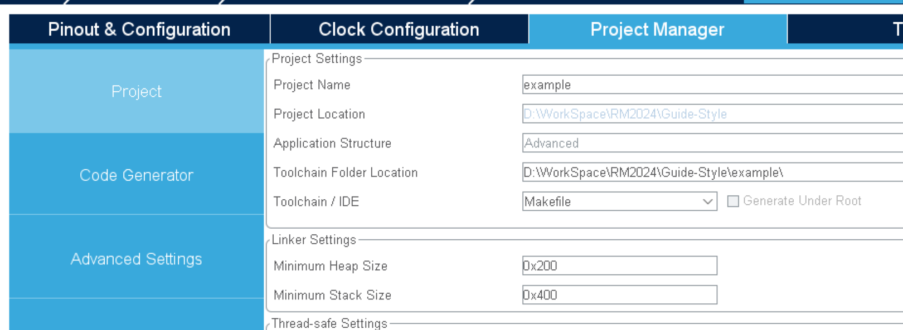
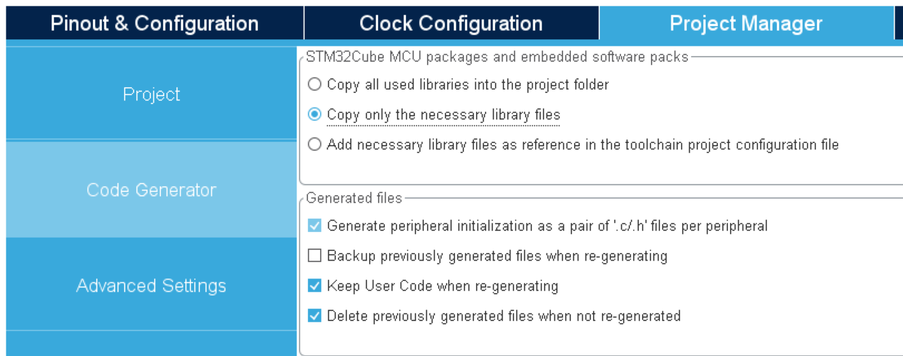
生成后的Makefile和xxxx_FLASH.ld移入`CMake`路径   
推荐使用CMake插件  
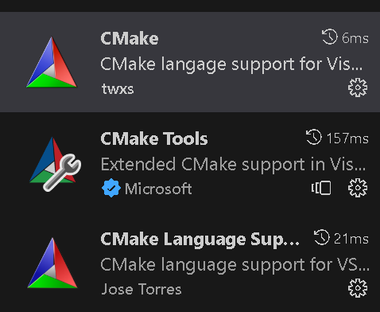  
CMake编译器设置为`未指定`  
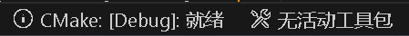  
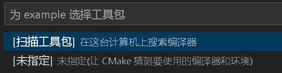  
插件自动选择在build路径下编译，也可自行设置  
插件可选择生成目标，可选择编译执行文件还是文档

## IDE代码分析&高亮
todo: 配置vscode的clang

## 调试
todo: cortex-debug+openocd  
https://zhuanlan.zhihu.com/p/72549457


# Clion配置
参考稚晖君知乎[文章](https://zhuanlan.zhihu.com/p/145801160)

# 一些说明

## MINGW
看稚晖君知乎文章会发现Clion需要用到MINGW，MINGW实际上的用途应该是编译`CMakeLists.txt`的生成文件，在VScode未指定编译器的情况下，自动选择MINGW编译，若选择了`gcc-arm-none-eabi`，在生成前会进行测试并显示错误，此时需在cmake文件的project前添加  
```CMake
# Without this flag, CMake is unable to pass the test compilation check
set(CMAKE_TRY_COMPILE_TARGET_TYPE STATIC_LIBRARY)
```

## 多编译器选择
当前项目使用的编译器是`gcc-arm-none-eabi`，但CMake实际上能支持Keil的armcc和armclang编译器，但配置仍需调试。
### 问题
`armclang.make`在最终armlink时出现`Error: L6236E: No section matches selector`错误，但`startup_stm32f407xx.s`已加入并编译。`armcc.make`没有继续调试，后期有空再看
### 可能的解决方案
CMake官方项目其实有给出armcc和armclang的配置，可继续尝试  
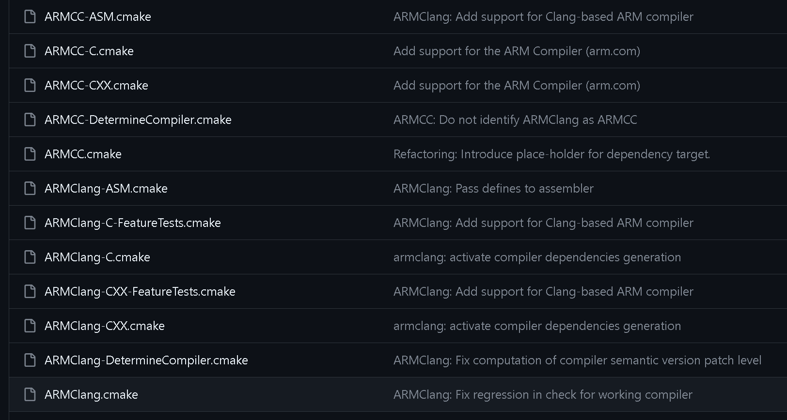  
[CMake官方Github](https://github.com/Kitware/CMake)


## ST调试时检测芯片是否正版
若是国产芯片或盗版ST芯片在烧录或调试时会显示`Not a genuine St Device! Abort connection`，Keil可以通过修改后继续烧录，STM32CubeIDE用网上的方法无法绕过。虽然现在用Clion或VScode，但难保有一天gdb添加了验证功能，留个记录供参考。
已尝试方法：
- [修改CPUTAPID](https://electronics.stackexchange.com/questions/681952/how-to-make-new-versions-of-stm32cubeide-1-9-to-debug-fake-stm32-chips)
- [外部启动gdbserver](https://www.cnblogs.com/DragonStart/p/12199455.html)  
  
用IDA进行分析`ST-LINK_gdbserver.exe`，0x40D6AC函数为判断连接状态，其中0x40D7EC函数返回0x12时为检测到盗版芯片  
  
可见Patch一下即可，但STM32CubeIDE还检测单片机的ID，由于gdb是通过socket通信的，可以用wireshark抓包对比一下正版和盗版。  
  
结合IDA调试可见有一段类似于验证，通过dll注入修改ws2_32的send函数并修改最终能正常使用。检测是否为验证通信的逻辑有待改善，但此方法可令STM32CubeIDE正常调试  
[HackSTlinkGDB源码](https://github.com/JamesHoi/HackSTLinkGDB)  
可参考[暴力升级ST-Link](https://github.com/armink/HackSTLinkUpgrade)

# Doxygen文档配置
doxygen是一个出色的生成文档的工具，不但能根据源码注释生成文档，还支持Markdown，下面介绍一下本文档的配置设定。文档文件结构如下
```bash
Docs
├───chassis # 测试文档文件夹 
│   └───chassis.md # 测试文档
├───doxygen # doxygen的配置文件
│   ├───doxygen-awesome-css # doxygen主题
│   ├───Doxygen.in # Doxygen配置，CMake根据这个生成
│   ├───DoxygenLayout.xml.in # Doxygen目录配置
│   └───...
├───examples # 文档的范例代码
│   └───example_main.c # 范例代码
├───image # Markdown图片文件夹
├───CMakeLists.txt # CMake配置
├───mainpage.md # 文档主页
├───test.md # 测试文档
└───...
```
doxygen基本支持Markdown的所有功能，甚至可以在Markdown里用doxygen的一些功能，见[测试文章](@ref test)，所以推荐使用Markdown编写文档，毕竟方便且可专注于编写文档内容。

## 文档格式及语法
下面给出了一个文档格式例子
```Markdown
# 标题 {#testpage1}
[TOC]

正文1
\include example_main.c
[测试文档2](@ref #testpage2)
正文2

```
1. 标题旁的`{#testpage1}`定义了这个文档的label，别的文档或目录可根据label引用。例如在其他文档用`[测试文档1](@ref #testpage1)`即可实现跳转到这个文档的链接。  
2. 其次，`\include xxx`可实现范例代码的插入，其中范例代码必须放在`examples`路径下。  
3. Markdown图片必须放在`image`路径内，编写md的时候记得设置一下图片保存路径
4. `[TOC]`是生成目录，非常建议开启

## CMake配置
`Docs/CMakeLists.txt`配置了一些内容  
`EMEDDED_DOXY_PROJECT_NAME`，`EMEDDED_DOXY_PROJECT_NUMBER`，`EMEDDED_DOXY_PROJECT_BRIEF`见下图
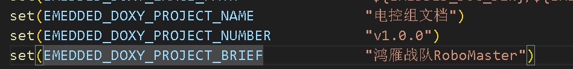  
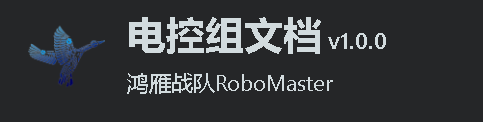  
`EMEDDED_DOC_TREE`和`EMEDDED_DOC_ENDTREE`定义了目录头尾的文档，格式如下  
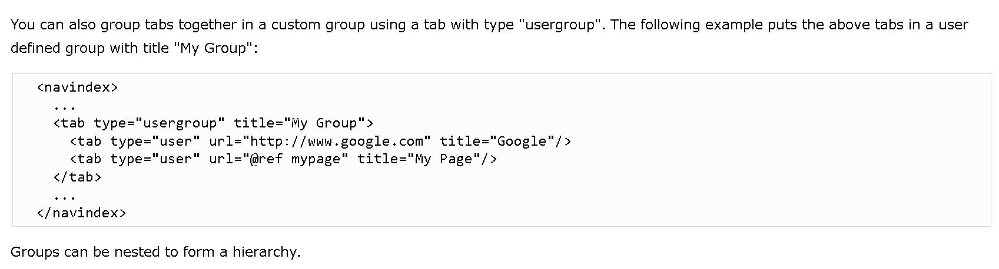  
`EMEDDED_DOC_TREE`在介绍后插入，`EMEDDED_DOC_ENDTREE`在文件后插入，详细的见doxygen文档及`DoxygenLayout.xml.in`文件  
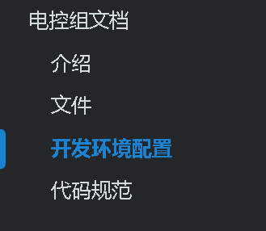  
可用`usergroup`做到子目录，`usergroup`也可配置文档  
```xml
<tab type="usergroup" url="@ref group_page" title="My Group">
    <tab type="user" url="@ref test" title="test"/>
</tab>
```
`EMEDDED_DOXY_EXCLUDE_PATTERNS`可以让doxygen排除源代码目录，编译目录等  
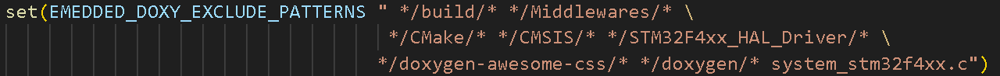

## 细节
### 主题插件
插件全上了，详细见[文档](https://jothepro.github.io/doxygen-awesome-css/md_docs_2extensions.html)，其中需要修改header.html等doxygen配置，插件配置并未写在cmake中。

### 版本问题
```bash
[build] warning: The selected output language "chinese" has not been updated
[build] since release 1.9.4.  As a result some sentences may appear in English.
```
doxygen 1.9.8版本实际上还未完成翻译中文，但大部分已翻译，没翻译的可自行替换，例如topics
```xml
<tab type="topics" visible="yes" title="模块" intro="这里列出了所有模块:"/>
```
注：doxygen的`module`貌似已经意思是c++20的模块特性，`topics`以前doxygen就翻译为模块。  
其次，doxygen1.9.8以前的版本Markdown的`@ref`定向会有点问题
